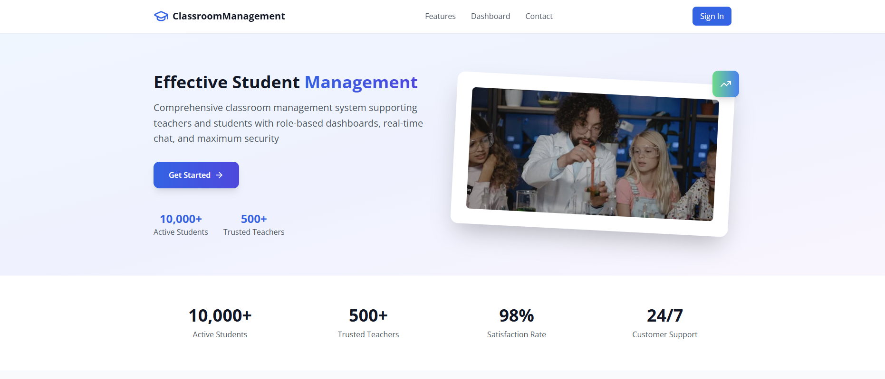

# 🎓 Classroom Management System

A comprehensive classroom management application built with React, TypeScript, and modern web technologies. This system provides role-based dashboards for instructors and students with real-time communication capabilities.

# Screenshots


## ✨ Features

### 🔐 Authentication & Security

- **Phone Number Authentication**: Quick verification via 6-digit SMS code using Twilio technology
- **Role-Based Access Control**: Separate authentication flows for instructors and students
- **JWT Token Management**: Secure token-based authentication
- **Email Verification**: Account setup verification for students
- **Maximum Security**: Data encryption and secure user information storage

### 👨‍🏫 Instructor Dashboard

- **Student Management**: Add, edit, delete students with detailed profiles
- **Lesson Management**: Create lessons and assign them to students
- **Progress Tracking**: Monitor student lesson completion and progress
- **Real-time Chat**: Direct communication with students
- **Account Setup Emails**: Automatically send account setup invitations to students

### 👨‍🎓 Student Dashboard

- **Lesson Management**: View assigned lessons and mark them as completed
- **Progress Tracking**: Track personal learning progress
- **Real-time Chat**: Communicate directly with instructors
- **Account Setup**: Complete profile setup after email invitation

### 💬 Real-time Communication

- **Socket.io Integration**: Real-time messaging between instructors and students
- **Chat History**: Persistent message storage and retrieval
- **Online Status**: See who's currently online
- **Message Notifications**: Real-time message delivery

## 🛠️ Tech Stack

### Frontend

- **React 19.1.0** - Modern React with latest features
- **TypeScript 5.8.3** - Type-safe development
- **Vite 5.4.0** - Fast build tool and dev server
- **React Router Dom 7.6.3** - Client-side routing

### UI & Styling

- **Ant Design 5.26.4** - Professional UI component library
- **Tailwind CSS 3.4.17** - Utility-first CSS framework
- **Lucide React 0.525.0** - Beautiful icons
- **React Toastify 11.0.5** - Toast notifications

### Communication & Data

- **Axios 1.10.0** - HTTP client for API calls
- **Socket.io Client 4.8.1** - Real-time communication
- **JWT Decode 4.0.0** - JWT token handling

### Development Tools

- **ESLint** - Code linting and formatting
- **TypeScript ESLint** - TypeScript-specific linting rules
- **PostCSS & Autoprefixer** - CSS processing

## 🚀 Getting Started

### Prerequisites

- **Node.js** >= 18.20.4 (for Vite 7.x compatibility)
- **npm** or **yarn**
- Access to backend API server

### Installation

1. **Clone the repository**

   ```bash
   git clone <repository-url>
   cd ClassRoomManagerFE
   ```

2. **Install dependencies**

   ```bash
   npm install
   ```

3. **Environment Configuration**
   Create a `.env` file in the root directory with the following variables:

4. **Start the development server**

   ```bash
   npm run dev
   ```

5. **Build for production**
   ```bash
   npm run build
   ```

## 📱 Application Structure

### Pages

- **Home** (`/`) - Landing page with features overview
- **Login** (`/login`) - Authentication for both instructors and students
- **Account Setup** (`/account-setup/:verificationToken`) - Student account completion
- **Instructor Dashboard** (`/instructor/dashboard`) - Protected instructor interface
- **Student Dashboard** (`/student/dashboard`) - Protected student interface

### Key Components

#### Authentication Flow

1. **Role Selection** - Users choose between instructor or student
2. **Credential Input** - Phone number for instructors, email/password for students
3. **Access Code Verification** - 6-digit code verification via SMS/email
4. **Dashboard Redirect** - Role-based dashboard access

#### Dashboard Features

- **Sidebar Navigation** - Role-specific menu items
- **Header with Avatar** - User profile and logout functionality
- **Content Area** - Dynamic content based on selected menu item
- **Real-time Chat** - Integrated messaging system

## 🔧 Configuration

### Vite Configuration

The project uses Vite with React plugin and TypeScript support. Configuration includes:

- React plugin for JSX transformation
- TypeScript compilation
- CSS processing with PostCSS and Tailwind

### Tailwind CSS

Configured for modern utility-first styling with:

- Custom color palette
- Responsive design utilities
- Component-friendly classes

### ESLint Configuration

Strict linting rules including:

- React hooks rules
- TypeScript-specific rules
- Import/export conventions

## 🔒 Security Features

- **JWT Authentication** - Secure token-based authentication
- **Role-based Access Control** - Protected routes based on user type
- **Input Validation** - Client-side form validation
- **API Request Interceptors** - Automatic token attachment
- **Error Handling** - Comprehensive error management

## 📊 Data Management

### API Services

- **Authentication Services** - Login, registration, token management
- **Student Management** - CRUD operations for student data
- **Lesson Management** - Lesson creation, assignment, progress tracking
- **Chat Service** - Real-time messaging functionality
- **Socket Service** - WebSocket connection management

### State Management

- **Local State** - Component-level state with React hooks
- **Local Storage** - Token and user type persistence
- **Context** - Authentication state management

## 🎨 UI/UX Features

- **Responsive Design** - Mobile-first approach with Tailwind CSS
- **Modern Interface** - Clean, professional design with Ant Design
- **Loading States** - User feedback during API operations
- **Error Messages** - Clear error communication
- **Success Notifications** - Positive feedback for user actions

## 🚦 Routing

### Public Routes

- Home page
- Login page
- Account setup (with verification token)

### Protected Routes

- Instructor dashboard and sub-pages
- Student dashboard and sub-pages
- Role-based access control

## 📞 Real-time Communication

### Socket.io Integration

- **Connection Management** - Automatic connection with authentication
- **Message Broadcasting** - Real-time message delivery
- **Online Status** - User presence tracking
- **Reconnection Logic** - Automatic reconnection on network issues

## 🧪 Development

### Available Scripts

- `npm run dev` - Start development server
- `npm run build` - Build for production
- `npm run lint` - Run ESLint
- `npm run preview` - Preview production build


## 🐛 Troubleshooting
- if you test by phone number, there are only 2 valid prefixes +84 or 0 For example: +84123456789 or 0123456789
### Common Issues

1. **Node.js Version Compatibility**

   - Ensure Node.js >= 18.20.4 for Vite 7.x compatibility
   - If using older Node.js, downgrade Vite to 5.x

2. **Environment Variables**

   - Verify all required VITE\_ prefixed environment variables are set
   - Check API endpoint URLs are correct

3. **Socket Connection Issues**
   - Ensure backend Socket.io server is running
   - Check CORS configuration on backend

## 📄 License

This project is private and proprietary.

## 👥 Team

- **Developer**: **Nguyen Tan Loc aka JohnMarston**
- **Project**: Classroom Management System
- **Technology Stack**: React + TypeScript + Vite

---

For more information or support, please contact the development team.
